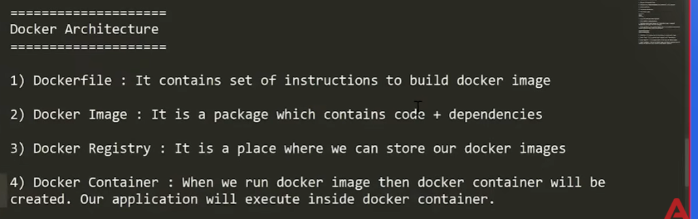
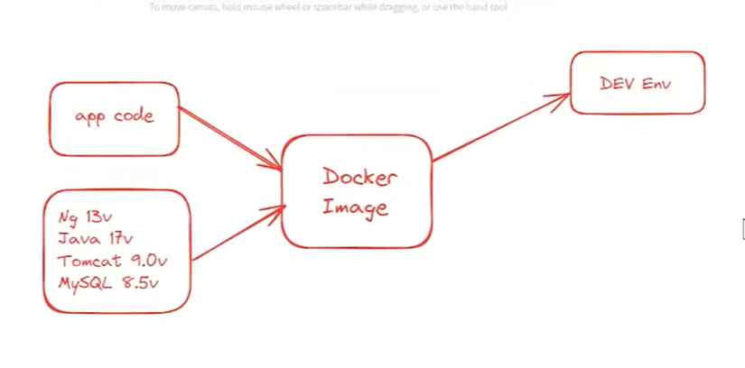
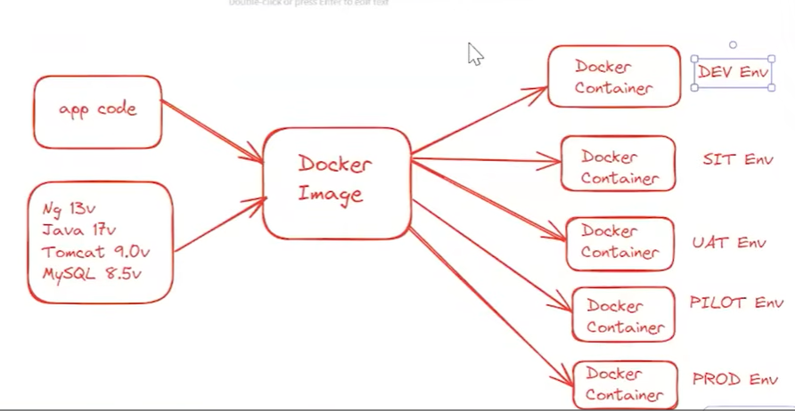
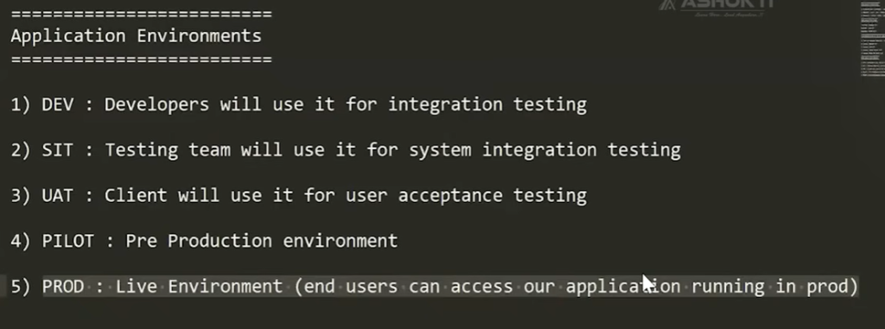
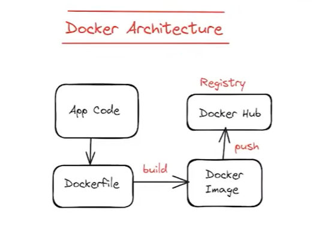
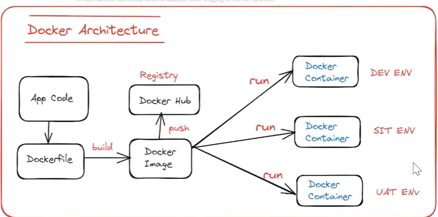
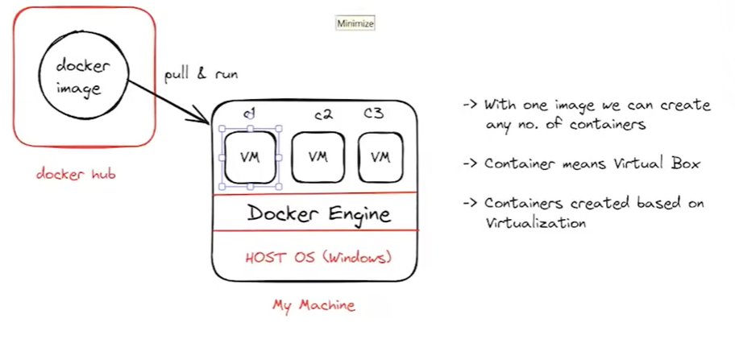

# 🖼️ Docker Visual Architecture & Presentation Slides Deck

> **A Complete Visual Reference Manual and Presentation Deck for the Docker Masterclass.**  
> Contains all architectural diagrams, environment promotion pipelines, container lifecycle flows, and word-for-word speaker notes for each slide.  
> 
> 📺 **Companion Video Masterclass:** [Ashok IT - Docker & Kubernetes Full Course in 5 Hours](https://youtu.be/2bg9MAtiHwo?si=HVE5_7IaKjV9kuex)

---

## 🎬 Video Syllabus & Repository Track Alignment

| Video Lecture Topic | Slide Diagram | Repository Implementation Track | Key Primitives / Concepts |
|:---|:---|:---|:---|
| **Virtualization vs Containers** | [Slide 7](#7-docker-engine--container-virtualization-architecture) | Architecture Foundations | Host OS, Docker Engine, C1/C2/C3 isolation |
| **Docker Core Architecture** | [Slide 1](#1-the-4-core-pillars-of-docker-architecture) | All Tracks | Dockerfile, Image, Registry, Container |
| **Packaging Code & Dependencies** | [Slide 2](#2-the-packaging-principle-code--runtime-dependencies) | [Track 1 (`01-single-container`)](./01-single-container/) | Multi-stage Dockerfile, Node v20, SQLite |
| **Build & Push to Registry** | [Slide 5](#5-the-build--push-lifecycle) | [Track 4 (`04-cicd-automation`)](./04-cicd-automation/) | `docker build`, `docker push`, GHCR, Docker Hub |
| **Multi-Environment Promotion** | [Slide 3](#3-enterprise-environment-promotion-pipeline) & [Slide 4](#4-the-5-enterprise-application-environments) | [Track 4 (`04-cicd-automation`)](./04-cicd-automation/) | DEV ➔ SIT ➔ UAT ➔ PILOT ➔ PROD parity |
| **Registry to Multi-Server Deploy** | [Slide 6](#6-registry-to-multi-environment-deployment) | [Track 4 (`04-cicd-automation`)](./04-cicd-automation/) | Single image digest, environment-specific `.env` |
| **Multi-Container Apps & DB** | Architecture Guides | [Track 2 (`02-multi-container`)](./02-multi-container/) | `docker-compose.yml`, PostgreSQL, Redis, Networks |
| **Hybrid DB & Real-World Bridge** | Architecture Guides | [Track 3 (`03-host-database-mysql`)](./03-host-database-mysql/) | `host.docker.internal:3306`, MySQL user host grants |

---

## 📑 Slide Index

1. [Slide 1: The 4 Core Pillars of Docker Architecture](#1-the-4-core-pillars-of-docker-architecture)
2. [Slide 2: The Packaging Principle (Code + Runtime Dependencies)](#2-the-packaging-principle-code--runtime-dependencies)
3. [Slide 3: Enterprise Environment Promotion Pipeline](#3-enterprise-environment-promotion-pipeline)
4. [Slide 4: The 5 Enterprise Application Environments](#4-the-5-enterprise-application-environments)
5. [Slide 5: The Build & Push Lifecycle](#5-the-build--push-lifecycle)
6. [Slide 6: Registry to Multi-Environment Deployment](#6-registry-to-multi-environment-deployment)
7. [Slide 7: Docker Engine & Container Virtualization Architecture](#7-docker-engine--container-virtualization-architecture)

---

## 1. The 4 Core Pillars of Docker Architecture

  

### 🔍 Concept Breakdown
1. **`Dockerfile` (The Recipe)**: A plain-text configuration file containing sequential instructions (`FROM`, `COPY`, `RUN`, `CMD`) to assemble an application environment.
2. **`Docker Image` (The Frozen Blueprint)**: An immutable, portable package containing application code, system libraries, binaries, runtimes, and default settings.
3. **`Docker Registry` (The Central Warehouse)**: A remote repository system (such as **Docker Hub** or **GitHub Container Registry - GHCR**) where versioned images are stored, indexed, and distributed.
4. **`Docker Container` (The Running Process)**: A live, isolated process instantiated from an image. The application executes inside this isolated sandbox on the host kernel.

> 🎙️ **Speaker Cue for Your Team:**  
> *"Think of a Dockerfile as the recipe, the Docker Image as the packaged frozen cake, the Registry as the bakery warehouse where cakes are shipped, and the Container as the cake being served and eaten on the table."*

---

## 2. The Packaging Principle (Code + Runtime Dependencies)

  

### 🔍 Concept Breakdown
* **The Traditional Problem**: Installing Node.js, Angular, Java 17, Apache Tomcat, and MySQL drivers directly on developer laptops leads to version collisions, broken paths, and OS dependency drift.
* **The Docker Solution**:
  * **Application Code**: React / Express / Java source code.
  * **Stack Dependencies**: Node v20, Java 17, Tomcat 9, MySQL connector libraries, and Linux base OS binaries.
  * **Unified Packaging**: Both code and runtimes are bundled into a single **Docker Image**, creating a deterministic, self-contained software appliance.

> 🎙️ **Speaker Cue for Your Team:**  
> *"Instead of asking a new teammate to spend 3 days installing Java, Tomcat, and MySQL on their laptop, we package our code AND all of its dependencies together inside a Docker image. One command gives them the entire running stack."*

---

## 3. Enterprise Environment Promotion Pipeline

  

### 🔍 Concept Breakdown
* **Build Once in CI**: The application code and dependencies are compiled into a **Docker Image** exactly once.
* **Multi-Environment Promotion**: That identical image is deployed across all organizational stages:
  1. **DEV Container**: For developer unit and integration testing.
  2. **SIT Container**: For system-level integration testing with automated QA suites.
  3. **UAT Container**: For client acceptance testing and business sign-off.
  4. **PILOT Container**: For pre-production rehearsal and load/stress testing.
  5. **PROD Container**: For real-world end-user transactions.
* **Configuration Decoupling**: The binary container remains 100% identical; only the `.env` configuration file changes across environments.

> 🎙️ **Speaker Cue for Your Team:**  
> *"We never re-bake or recompile an image for each environment! The exact same image that passed developer testing in DEV moves to SIT, UAT, PILOT, and finally PROD. That completely eliminates the 'works on my machine' bug."*

---

## 4. The 5 Enterprise Application Environments

  

### 🔍 Detailed Environment Reference Table

| Environment | Primary Target Users | Validation Objective | Docker & CI/CD Strategy |
|:---|:---|:---|:---|
| **1) DEV** | Developers | Rapid feature creation, debugging, unit tests. | Docker Compose with **bind mounts** (`./src:/app`) and hot-reloading (Vite/Nodemon) for sub-second updates without image rebuilds. *(Our Track 2 & 3)* |
| **2) SIT** | QA / Test Engineers | **System Integration Testing**: Multi-service, API, and database interoperability. | Automated CI builds test image tags (`:sha-<hash>`) deployed to isolated testing clusters with automated integration test suites. |
| **3) UAT** | Client / Business Owners | **User Acceptance Testing**: Business workflows & contractual acceptance. | Stable release-candidate images running with sanitized real-world seed data for client sign-off. |
| **4) PILOT** | DevOps / SRE / Security | **Pre-Production Staging**: Exact replica of live production infrastructure. | Final rehearsals, stress/load testing, non-root UID 1001 security audits, and database migration dry-runs. |
| **5) PROD** | Live End Users | **Production**: Real commercial business transactions requiring 99.99% uptime. | Immutable, cryptographically verified images from GHCR deployed with rolling updates and Watchtower/Kubernetes monitoring. *(Our Track 4)* |

> 🎙️ **Speaker Cue for Your Team:**  
> *"In enterprise software, code doesn't jump straight from a laptop to production. It follows a 5-step promotion ladder: developers build in DEV, QA verifies in SIT, the client signs off in UAT, DevOps rehearses in PILOT, and finally users use it in PROD."*

---

## 5. The Build & Push Lifecycle

   Dockerfile -> Docker Image -> Registry" width="600"/>

### 🔍 Concept Breakdown
1. **Source Control**: Developers write `App Code` and define build instructions in a `Dockerfile`.
2. **`docker build`**: The Docker build engine parses the instructions, downloads base layers, compiles source code, and outputs a **Docker Image**.
3. **`docker push`**: The compiled image is pushed over TLS to a remote **Docker Registry** (Docker Hub or GHCR) with an immutable cryptographic tag (e.g., `:v1.2.0`).

> 🎙️ **Speaker Cue for Your Team:**  
> *"This is the core Continuous Integration (CI) loop: code plus Dockerfile builds into an image, which is published to our central registry for any server in the world to download."*

---

## 6. Registry to Multi-Environment Deployment

  

### 🔍 Concept Breakdown
* **Continuous Delivery (CD)**:
  Once the image is registered in Docker Hub / GHCR:
  * The **DEV server** runs `docker run` (or `docker compose up`) with DEV environment variables.
  * The **SIT server** pulls that same image and connects to the integration database.
  * The **UAT server** runs that same image for client testing.
* **Guaranteed Parity**: Because all environments pull the exact same image digest, environment differences are zero.

> 🎙️ **Speaker Cue for Your Team:**  
> *"Notice that DEV, SIT, and UAT all pull from the same single image source. If a bug appears in SIT, it is guaranteed to be reproducible in DEV because they share the exact same binary environment."*

---

## 7. Docker Engine & Container Virtualization Architecture

  

### 🔍 Concept Breakdown
* **Host Operating System (Windows / Linux / macOS)**:
  The physical machine hardware and host kernel.
* **Docker Engine**:
  The background daemon managing Linux Namespaces, Cgroups, virtual bridge networks, and storage drivers.
* **Containers (C1, C2, C3)**:
  * From **one single Docker Image**, you can instantiate **any number of isolated containers**.
  * Each container runs in its own isolated user-space sandbox with its own virtual IP address and process tree.
  * **Containers vs VMs**: Containers do NOT run a heavy guest OS or hypervisor; they share the host kernel, making them start in milliseconds while consuming under 50MB of RAM.

> 🎙️ **Speaker Cue for Your Team:**  
> *"Unlike VirtualBox or VMware which need gigabytes of RAM to run separate guest operating systems, Docker Engine lets us spin up 50 lightweight isolated containers from a single image on our machine in seconds."*

---

## 🔗 Repository Navigation

* **[README.md](./README.md)** — Main Architecture & Quick Execution Cheatsheet
* **[commands.md](./commands.md)** — Essential Common Docker Commands Reference Manual
* **[Track 1: Single-Container Monolith](./01-single-container/)** — Monolithic packaging
* **[Track 2: Multi-Container Microservices](./02-multi-container/)** — Decoupled services
* **[Track 3: Host Database Bridge](./03-host-database-mysql/)** — Hybrid host database bridge
* **[Track 4: Automated CI/CD & Deployments](./04-cicd-automation/)** — GHCR + Watchtower auto-deployments
* **[Full Technical Masterclass](./docs/docker-masterclass.md)** — Deep-dive Docker fundamentals
